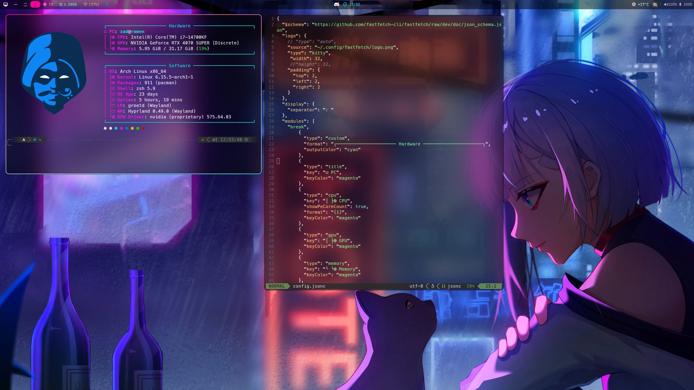

# Synthetic Peace
*A cyberpunk - synthwave inspired Hyprland rice.*

## WIP

This is my current Arch desktop setup and it is still a work in progress. Some configurations might differ slightly from the screenshots.

Some configs and dotfiles are still very similar to existing themes (the waybar especially). I use them as a starting point. The original authors of configs I use without edits, or with minimal edits, will be credited.

## Target aesthetics

I aim at creating a neon yet comfy setup. The goal is to orbit around the cyberpunk/synthwave aesthetics and colors without being too aggressive and saturated.

The wallpaper I'm using at the moment is not included in the files because it's easy to find, and eventhough it looks nice, I'm looking for something a bit darker and less related to Cyberpunk Edgerunners or Cyberpunk 2077 (eventhough I loved the game and show).

## Ingredients
- [Hyrland](https://github.com/hyprwm/Hyprland) (duh.)
- [Hyprlock](https://github.com/hyprwm/hyprlock)
- [Hypridle](https://github.com/hyprwm/hypridle)
- [Hyprexpo](https://github.com/hyprwm/hyprland-plugins/tree/main/hyprexpo)
- [eww](https://github.com/elkowar/eww) (not yet implemented)
- [dunst](https://github.com/dunst-project/dunst)
- [fastfetch](https://github.com/fastfetch-cli/fastfetch)
- [kitty](https://github.com/kovidgoyal/kitty)
- [nvim](https://github.com/neovim/neovim)
- [rofi](https://github.com/davatorium/rofi)
- [waybar](https://github.com/Alexays/Waybar)
- [swww](https://github.com/LGFae/swww)

## Todo

- [x] Switch from Alacritty to Kitty.
- [ ] Style dunst to match the theme.
- [x] ~Style fuzzel to match the theme.~ Switched to rofi.
- [ ] Eww widgets.
- [x] List programs.
